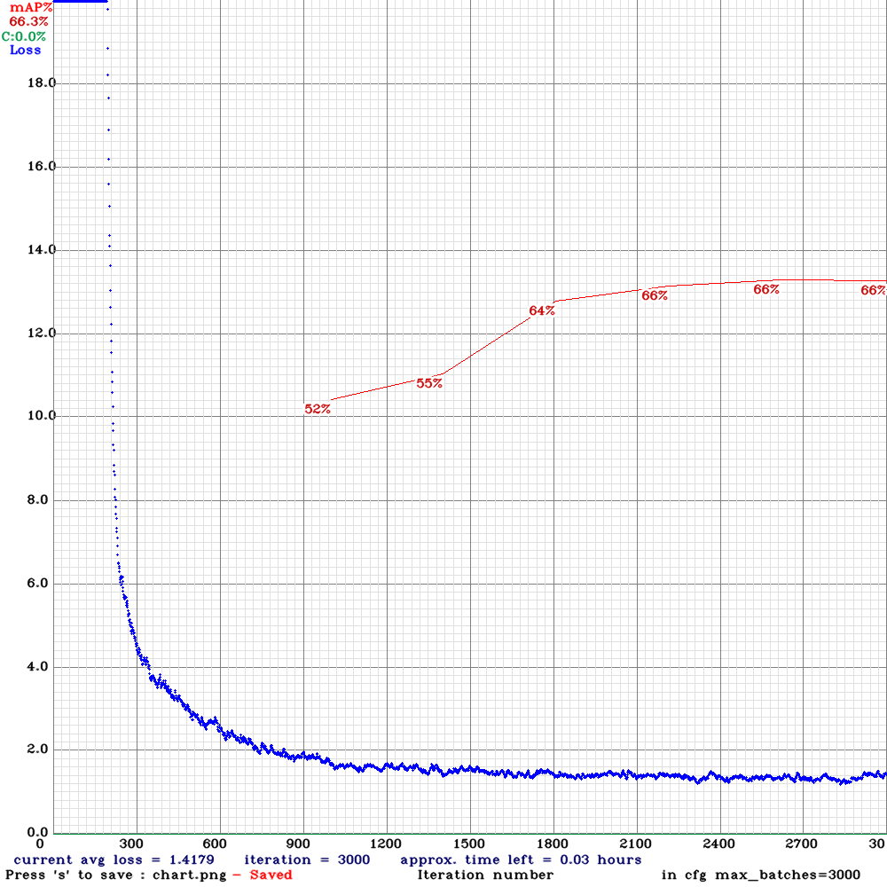

# Training YOLO to person detection with VOC Pascal

This repo wraps some scripts to train YOLOv3-Tiny and YOLOv3-Tiny + XNOR-Net with **Darknet** (https://github.com/AlexeyAB/darknet) by the use of a mixing of Pascal VOC 2007 and 2012 datasets. To make predictions only with person objects, just images with the *person* class label are taken from the datasets. The Pascal VOC datasets are divided in three subsets of images: training, validation and test.

All the images of validation and training of both datasets (2007 and 2012) were used to compose the training dataset of the CNNs in this repo. About the test subsets, the images from 2012 test subset were used with the training dataset. The images from 2007 test subset are used as the validation dataset. The following charts of training error and mAP metrics was achieved with the train in Google Colab:

## YOLOv3-Tiny loss and mAP evaluation


## How to use this repo in Google Colab

* Clone this repo and run `config`:
  - It will clone Darknet repo and compile then with GPU flags;
  - It will also request your permission to give access to Google Drive and use it as a backup of the logs, weights and charts;
  - The datasets are downloaded from Pascal VOC site, so it can take a few minutes;
  - Next, the images are threated as described previously;
  - The weights from yolov3-tiny in Darknet repo are used

```bash
!git clone https://github.com/himewel/voc-person-detection
!./config
```

* Run `train` with the target model as command line parameter: yolov3-tiny or yolov3-tiny_xnor:
  - It will start the training and save the print outputs as a log;
  - At the end of the training, the chart is also saved;

```bash
!bash train.bash yolov3-tiny
!bash train.bash yolov3-tiny_xnor
```

* If you want to watch the loss and mAP chart updating in live, you can start a ngrok server before run the trainment script:

```bash
!wget -c https://bin.equinox.io/c/4VmDzA7iaHb/ngrok-stable-linux-amd64.zip
!unzip -n ngrok-stable-linux-amd64.zip

get_ipython().system_raw('./ngrok http 8090 &')
!sleep 5

!curl -s http://localhost:4040/api/tunnels | python3 -c \
 "import sys, json; print(json.load(sys.stdin)['tunnels'][0])"
```
